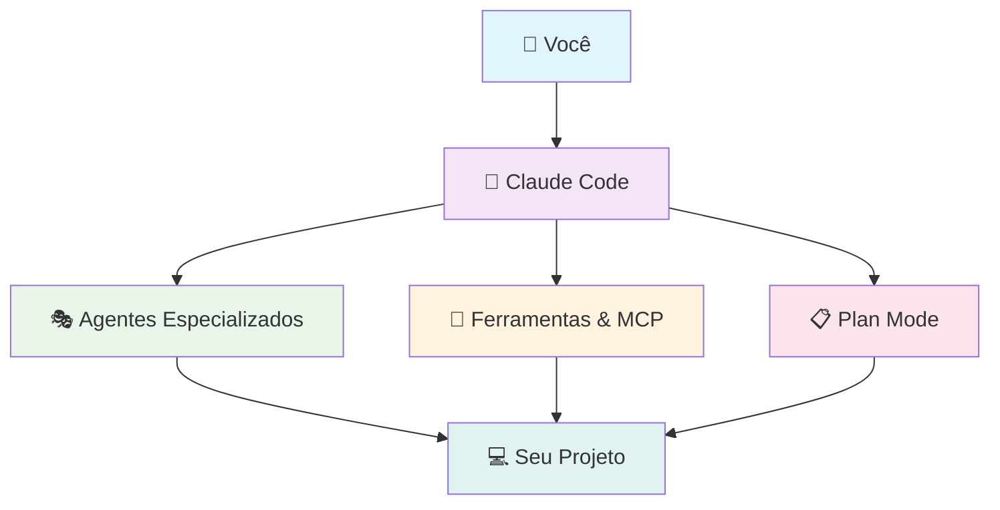

# 🚀 Claude Code Expert - Documentação Definitiva

<div align="center">

**A documentação mais completa do Claude Code em português brasileiro**  
*Para desenvolvedores, times DevSecOps e profissionais de cibersegurança*

[](#)
[](#)
[](#)
[](#)

</div>

---

## 🎯 Visão Geral

Este é o **guia definitivo** para maximizar sua produtividade com Claude Code. Aqui você encontrará:

- 🛡️ **Agentes Especializados** - 8 agentes prontos para uso em desenvolvimento e segurança
- 📚 **Documentação Completa** - Tutoriais, exemplos práticos e melhores práticas
- ⚡ **Configurações Otimizadas** - Hooks, MCP servers e automações
- 🔐 **Segurança por Design** - Práticas para Red Team, Blue Team e DevSecOps

<div align="center">



</div>

---

## 🚀 Início Rápido

### ⚡ Setup em 3 Passos

```bash
# 1. Clone este repositório
git clone https://github.com/seu-usuario/claude-code-expert.git
cd claude-code-expert

# 2. Copie a configuração para seu projeto
cp -r claude/ ~/.claude/
cp Exemplo-CLAUDE.md ~/.claude/CLAUDE.md

# 3. Configure suas credenciais
export ANTHROPIC_API_KEY="sua-chave-aqui"
```

### 🎯 Seus Primeiros Comandos

```bash
# Teste básico
claude code "Olá Claude, como você está?"

# Use um agente especializado
claude code --agent neo "Analise as ameaças de segurança deste projeto"

# Ative o plan mode para tarefas complexas
claude code --plan "Refatore este código seguindo Clean Code"
```

---

## 🎭 Agentes Especializados

<div align="center">

### 🌟 **A Equipe Definitiva de Desenvolvimento**

</div>

| Agente | Especialidade | Quando Usar |
|--------|---------------|-------------|
| 🎯 **[Neo](claude/agents/neo.md)** | Threat Modeling & OWASP | Análise de ameaças e modelagem de segurança |
| ⚡ **[Trinity](claude/agents/trinity.md)** | Vulnerability Scanning | Detecção e correção de vulnerabilidades |
| 🧙 **[Morpheus](claude/agents/morpheus.md)** | Clean Code & Refactoring | Limpeza de código e eliminação de technical debt |
| 🔮 **[Oracle](claude/agents/oracle.md)** | Documentation & Knowledge | Documentação completa e arquitetura de informação |
| 🤖 **[Agent Smith](claude/agents/agent-smith.md)** | DevSecOps & CI/CD | Pipelines seguros multi-plataforma |
| 🏗️ **[Architect](claude/agents/architect.md)** | Testing & Quality | Testes unitários com 95%+ de cobertura |
| 🎭 **[Merovingian](claude/agents/merovingian.md)** | Performance & Observability | Otimização e monitoramento |
| 🌸 **[Persephone](claude/agents/persephone.md)** | UX/Frontend Quality | Interface e experiência do usuário |

### 🚀 Workflows Integrados

```bash
# Workflow completo de desenvolvimento seguro
dev_workflow() {
    claude code --agent neo "Crie modelo de ameaças"
    claude code --agent trinity "Escaneie vulnerabilidades"
    claude code --agent morpheus "Aplique Clean Code"
    claude code --agent oracle "Crie testes com 95%+ cobertura"
    claude code --agent agent-smith "Deploy pipeline CI/CD"
    claude code --agent architect "Gere documentação"
}

# Workflow de performance e UX
performance_workflow() {
    claude code --agent merovingian "Otimize performance"
    claude code --agent persephone "Melhore UX/acessibilidade"
    claude code --agent oracle "Valide com testes"
}
```

---

## 📚 Documentação Completa

### 🔧 **Configuração e Setup**
- 📋 [Instalação e Configuração](docs/instalacao-configuracao.md) - Setup completo do ambiente
- 🎯 [Uso Básico](docs/uso-basico.md) - Comandos essenciais e workflows
- 📋 [Plan Mode](docs/plan-mode.md) - Controle total sobre execução de tarefas

### 🛠️ **Ferramentas Avançadas**
- 🔌 [MCP Servers](docs/mcp-servers.md) - **NOVO!** Extensões poderosas (WhatsApp, Twitter, GitHub)
- 📋 [Plan Mode Completo](docs/plan-mode-completo.md) - **NOVO!** Controle total de execução
- 🪝 [Hooks e Automação](docs/hooks.md) - Automação de tarefas pré/pós execução
- 🎭 [Agentes Customizados](docs/agentes.md) - Criação e personalização de agentes

### 🔐 **Segurança e Qualidade**
- 🛡️ [Segurança](docs/seguranca.md) - Práticas seguras e Red/Blue Team
- 🎯 [Threat Modeling](docs/threat-modeling.md) - Integração com OWASP Threat Dragon
- ✅ [Boas Práticas](docs/boas-praticas.md) - Guidelines e padrões recomendados

### 📊 **Monitoramento e Otimização**
- 💰 [Modelos e Custos](docs/modelos-e-custos.md) - Otimização de custos API
- 📈 [Monitoramento de Uso](docs/monitoramento-uso.md) - Analytics e métricas
- 🎨 [Padrões de Prompts](docs/padroes-prompts.md) - Templates e estilos de output

---

## 🛡️ Segurança em Primeiro Lugar

### 🔴 **Red Team**
- Descoberta de vulnerabilidades
- Testes de penetração automatizados
- Simulação de ataques

### 🔵 **Blue Team** 
- Monitoramento e detecção
- Resposta a incidentes
- Hardening de sistemas

### ⚫ **DevSecOps**
- Security as Code
- Pipelines seguros
- Compliance automatizado

```bash
# Exemplo de análise de segurança completa
security_audit() {
    echo "🔍 Iniciando auditoria de segurança..."
    claude code --agent neo "Modele ameaças do sistema"
    claude code --agent trinity "Execute scan completo de vulnerabilidades"
    claude code --agent agent-smith "Valide configurações de segurança CI/CD"
}
```

---

## ⚡ Configuração Avançada

### 📁 Estrutura do Projeto

```
projeto/
├── .claude/
│   ├── settings.local.json    # Configurações do projeto
│   ├── hooks.json            # Automações
│   └── agents/               # Agentes customizados
├── CLAUDE.md                 # Instruções do projeto
└── scripts/                  # Automações extras
```

### 🔧 Configuração Recomendada

```json
{
  "allowedTools": ["Read", "Edit", "Bash", "Grep", "Glob"],
  "planMode": "auto",
  "outputStyle": "concise",
  "mcpServers": {
    "github": {
      "command": "npx",
      "args": ["@modelcontextprotocol/server-github"]
    }
  }
}
```

---

## 🔌 MCP Servers - Extensões Poderosas

### 🌟 **Transforme Claude Code em uma Plataforma Universal**

Os **MCP Servers** conectam Claude Code a qualquer sistema externo, criando possibilidades infinitas:

| Categoria | Servidores Disponíveis | Exemplos |
|-----------|----------------------|----------|
| 📱 **Social Media** | WhatsApp, Twitter, Reddit | Automação de posts, análise de sentimento |
| 🗄️ **Bancos de Dados** | PostgreSQL, MongoDB, Supabase | Consultas inteligentes, análise de dados |
| ☁️ **Cloud Services** | AWS, Google Cloud, Azure | Deploy automático, gestão de recursos |
| 🛠️ **Desenvolvimento** | GitHub, Docker, Puppeteer | Automação de workflows, testes E2E |
| 🎨 **Criação** | Blender, Design Tools | Automação 3D, geração de assets |

### ⚡ Setup Rápido MCP:

```json
{
  "mcpServers": {
    "whatsapp": {
      "command": "go",
      "args": ["run", "./whatsapp-mcp-server"]
    },
    "github": {
      "command": "npx",
      "args": ["@modelcontextprotocol/server-github"],
      "env": {
        "GITHUB_PERSONAL_ACCESS_TOKEN": "your-token"
      }
    }
  }
}
```

🔗 **[Ver Lista Completa de MCP Servers →](docs/mcp-servers.md)**

---

## 📈 Analytics e Dashboards

### 🖥️ **Interfaces Visuais Disponíveis**

| Interface | Descrição | Quando Usar |
|-----------|-----------|-------------|
| **Claudia GUI** | Desktop app completa | Desenvolvimento local |
| **Claude Code WebUI** | Interface web responsiva | Acesso remoto/mobile |
| **Analytics Dashboard** | Métricas de uso e custos | Monitoramento empresarial |

```bash
# Setup rápido do dashboard
npm install -g claude-code-webui
claude-code-webui --port 8080
# Acesse: http://localhost:8080
```

---

## 🤝 Contribuindo

Quer melhorar esta documentação? 

1. 🍴 Fork o repositório
2. 🌟 Crie uma branch: `git checkout -b minha-melhoria`
3. ✨ Faça suas alterações
4. 📤 Envie um PR

### 💡 **Ideias para Contribuir**
- Novos agentes especializados
- Melhorias na documentação
- Exemplos práticos adicionais
- Integrações com ferramentas

---

<div align="center">

### 🌟 **Feito com ❤️ para a comunidade de desenvolvedores brasileiros**

**[⭐ Star no GitHub](https://github.com/seu-usuario/claude-code-expert)** • **[🐛 Report Bug](https://github.com/seu-usuario/claude-code-expert/issues)** • **[💡 Request Feature](https://github.com/seu-usuario/claude-code-expert/issues)**

---

*"O futuro do desenvolvimento é aqui e agora. Com Claude Code, transformamos ideias em realidade com velocidade, qualidade e segurança."*

</div>
