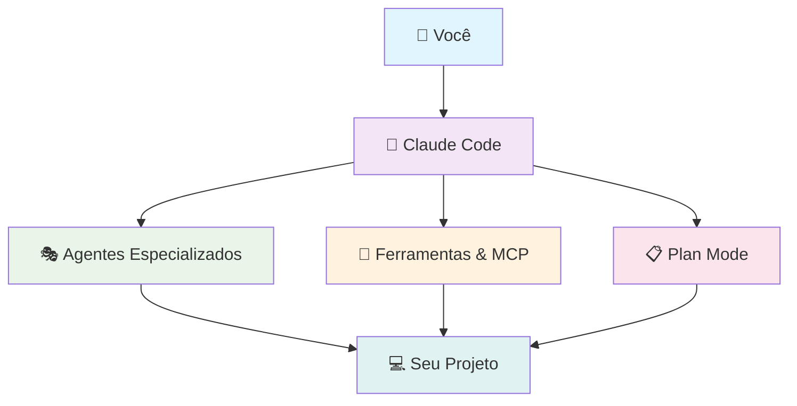

# 🚀 Claude Code Expert - Documentação Definitiva

<div align="center">

**A documentação mais completa do Claude Code em português brasileiro**  
*Para desenvolvedores, times DevSecOps e profissionais de cibersegurança*

[](#)
[](#)
[](#)
[](#)

</div>

---

## 🎯 Visão Geral

Este é o **guia definitivo** para maximizar sua produtividade com Claude Code. Aqui você encontrará:

- 🛡️ **Agentes Especializados** - 18 agentes especializados Matrix prontos para uso em desenvolvimento e segurança
- 📚 **Documentação Completa** - Tutoriais, exemplos práticos e melhores práticas
- ⚡ **Configurações Otimizadas** - Hooks, MCP servers e automações
- 🔐 **Segurança por Design** - Práticas para Red Team, Blue Team e DevSecOps

<div align="center">


```mermaid
graph TB
    A[👤 Você] --> B[🤖 Claude Code]
    B --> C[🎭 Agentes Especializados]
    B --> D[🔧 Ferramentas & MCP]
    B --> E[📋 Plan Mode]
    C --> F[💻 Seu Projeto]
    D --> F
    E --> F
    
    style A fill:#e1f5fe
    style B fill:#f3e5f5
    style C fill:#e8f5e8
    style D fill:#fff3e0
    style E fill:#fce4ec
    style F fill:#e0f2f1
```

</div>

---

## 🚀 Início Rápido

### ⚡ Setup em 2 Passos

```bash
# 1. Clone este repositório
git clone https://github.com/bob-reis/agents-of-matrix.git
cd agents-of-matrix

# O proximo passo execute apos copiar seu antigo CLAUDE.md ou configurações caso tenha

# 2. Copie a configuração para seu projeto
cp -r .claude/* ~/.claude/

```

### 🎯 Seus Primeiros Comandos

```bash
# Teste básico
claude code "Olá Claude, como você está?"

# Use um agente especializado
claude code --agent neo "Analise as ameaças de segurança deste projeto"

# Ative o plan mode para tarefas complexas
claude code --plan "Refatore este código seguindo Clean Code"
```

---

## 🎭 Agentes Especializados

<div align="center">

### 🌟 **A Equipe Definitiva de Desenvolvimento**

</div>

### 🌟 **Core Team - The Chosen Ones**

| Agente | Especialidade | Quando Usar |
|--------|---------------|-------------|
| 🎯 **[Neo](claude/agents/neo.md)** | Threat Modeling & OWASP | Análise de ameaças e modelagem de segurança |
| ⚡ **[Trinity](claude/agents/trinity.md)** | Vulnerability Scanning | Detecção e correção de vulnerabilidades |
| 🧙 **[Morpheus](claude/agents/morpheus.md)** | Clean Code & Refactoring | Limpeza de código e eliminação de technical debt |
| 🔮 **[Oracle](claude/agents/oracle.md)** | Documentation & Knowledge | Documentação completa e arquitetura de informação |

### 🔗 **The Operators**

| Agente | Especialidade | Quando Usar |
|--------|---------------|-------------|
| 🔗 **[Link](claude/agents/link.md)** | Defensive Security (Blue Team) | Monitoramento, detecção de ameaças, resposta a incidentes |
| 🛡️ **[Tank](claude/agents/tank.md)** | Data/Configuration Management | Migração de dados, configurações, secrets management |
| 🎖️ **[Dozer](claude/agents/dozer.md)** | XDR/SIEM/SOAR Specialist | Extended Detection & Response, SOAR playbooks, Yara/Suricata |
| 🏰 **[Zee](claude/agents/zee.md)** | Wazuh Master Specialist | Wazuh deployment, GitHub repos, regras customizadas |

### 👑 **The Captains**

| Agente | Especialidade | Quando Usar |
|--------|---------------|-------------|
| 👸 **[Niobe](claude/agents/niobe.md)** | Operations Security (OPSEC) | Segurança operacional, cultura de segurança, processos seguros |
| 🎖️ **[Commander Locke](claude/agents/commander-locke.md)** | Offensive Security (Red Team) | Testes de penetração éticos, validação de vulnerabilidades |
| ⚡ **[Ghost](claude/agents/ghost.md)** | Threat Intelligence & Attribution | CTI analysis, IOCs, TTPs, MITRE ATT&CK, attribution |

### 🏗️ **The Architects**

| Agente | Especialidade | Quando Usar |
|--------|---------------|-------------|
| 🏛️ **[Architect](claude/agents/architect.md)** | Testing & Quality Architecture | Testes unitários com 95%+ de cobertura, SonarCloud |
| 🏢 **[Counselor](claude/agents/counselor.md)** | Multi-tenant SaaS Specialist | Arquitetura multi-tenant, isolamento de dados, SaaS scaling |
| 🗝️ **[Keymaker](claude/agents/keymaker.md)** | Microservices Architect | Quebra de monólitos, design de microserviços, APIs |
| ☁️ **[Switch](claude/agents/switch.md)** | Multi-cloud Specialist | Arquitetura multi-cloud, migração, otimização de custos |

### 🎭 **The Programs**

| Agente | Especialidade | Quando Usar |
|--------|---------------|-------------|
| 🤖 **[Agent Smith](claude/agents/agent-smith.md)** | DevSecOps & CI/CD | Pipelines seguros multi-plataforma |
| 🎭 **[Merovingian](claude/agents/merovingian.md)** | Performance & Observability | Otimização e monitoramento |
| 🌸 **[Persephone](claude/agents/persephone.md)** | UX/Frontend Quality | Interface e experiência do usuário |

### 🚀 Workflows Integrados

```bash
# Workflow completo de desenvolvimento seguro - 18 Agentes Matrix
dev_workflow_complete() {
    echo "🎯 Fase 1: Threat Modeling & Vulnerability Assessment"
    claude code --agent neo "Crie modelo completo de ameaças"
    claude code --agent trinity "Escaneie e corrija vulnerabilidades"
    claude code --agent commander-locke "Execute pentesting ético controlado"
    
    echo "🏗️ Fase 2: Architecture & Code Quality"
    claude code --agent morpheus "Aplique Clean Code e SOLID"
    claude code --agent architect "Crie testes com 95%+ cobertura"
    claude code --agent keymaker "Projete arquitetura de microserviços"
    claude code --agent counselor "Configure multi-tenancy SaaS"
    
    echo "☁️ Fase 3: Infrastructure & DevOps"
    claude code --agent agent-smith "Configure pipelines DevSecOps"
    claude code --agent switch "Otimize arquitetura multi-cloud"
    claude code --agent tank "Configure data management e secrets"
    
    echo "🛡️ Fase 4: Security Operations & Advanced Monitoring"
    claude code --agent niobe "Estabeleça cultura de segurança operacional"
    claude code --agent link "Configure monitoramento defensivo e SIEM"
    claude code --agent dozer "Implemente XDR e playbooks SOAR automatizados"
    claude code --agent zee "Configure Wazuh SIEM enterprise completo"
    claude code --agent ghost "Configure feeds de CTI e análise de IOCs"
    claude code --agent merovingian "Configure observabilidade completa"
    
    echo "📚 Fase 5: Documentation & UX"
    claude code --agent oracle "Gere documentação completa"
    claude code --agent persephone "Otimize experiência do usuário"
}

# Workflow de arquitetura empresarial
enterprise_architecture_workflow() {
    claude code --agent counselor "Projete SaaS multi-tenant escalável"
    claude code --agent keymaker "Defina APIs e microserviços"
    claude code --agent switch "Configure estratégia multi-cloud"
    claude code --agent tank "Projete gestão de dados enterprise"
}

# Workflow de segurança completa
security_excellence_workflow() {
    claude code --agent neo "Modele ameaças avançadas"
    claude code --agent trinity "Execute análise de vulnerabilidades"
    claude code --agent commander-locke "Valide com red team testing"
    claude code --agent ghost "Correlacione com threat intelligence"
    claude code --agent dozer "Configure detecção avançada XDR/SOAR"
    claude code --agent zee "Implemente Wazuh SIEM completo"
    claude code --agent link "Configure blue team monitoring"
    claude code --agent niobe "Implemente OPSEC e cultura de segurança"
}
```

---

## 📚 Documentação Completa

### 🔧 **Configuração e Setup**
- 📋 [Instalação e Configuração](docs/instalacao-configuracao.md) - Setup completo do ambiente
- 🎯 [Uso Básico](docs/uso-basico.md) - Comandos essenciais e workflows
- 📋 [Plan Mode](docs/plan-mode.md) - Controle total sobre execução de tarefas

### 🛠️ **Ferramentas Avançadas**
- 🔌 [MCP Servers](docs/mcp-servers.md) - **NOVO!** Extensões poderosas (WhatsApp, Twitter, GitHub)
- 📋 [Plan Mode Completo](docs/plan-mode-completo.md) - **NOVO!** Controle total de execução
- 🪝 [Hooks e Automação](docs/hooks.md) - Automação de tarefas pré/pós execução
- 🎭 [Agentes Customizados](docs/agentes.md) - Criação e personalização de agentes

### 🔐 **Segurança e Qualidade**
- 🛡️ [Segurança](docs/seguranca.md) - Práticas seguras e Red/Blue Team
- 🎯 [Threat Modeling](docs/threat-modeling.md) - Integração com OWASP Threat Dragon
- ✅ [Boas Práticas](docs/boas-praticas.md) - Guidelines e padrões recomendados

### 🎭 **Agentes Matrix - 18 Especialistas**
- 🚀 [**NOVO!** Novos Agentes Matrix](docs/novos-agentes-matrix.md) - Dozer, Zee e Ghost especializados
- 📚 [Guia Completo - 18 Agentes](docs/agentes-18-completo.md) - Documentação completa de todos os agentes
- 🔄 [Workflows Enterprise](docs/agentes-18-completo.md#workflows-matrix-enterprise) - Workflows para projetos críticos

### 📊 **Monitoramento e Otimização**
- 💰 [Modelos e Custos](docs/modelos-e-custos.md) - Otimização de custos API
- 📈 [Monitoramento de Uso](docs/monitoramento-uso.md) - Analytics e métricas
- 🎨 [Padrões de Prompts](docs/padroes-prompts.md) - Templates e estilos de output

---

## 🛡️ Segurança em Primeiro Lugar

### 🔴 **Red Team**
- Descoberta de vulnerabilidades
- Testes de penetração automatizados
- Simulação de ataques

### 🔵 **Blue Team** 
- Monitoramento e detecção
- Resposta a incidentes
- Hardening de sistemas

### ⚫ **DevSecOps**
- Security as Code
- Pipelines seguros
- Compliance automatizado

```bash
# Exemplo de análise de segurança completa
security_audit() {
    echo "🔍 Iniciando auditoria de segurança..."
    claude code --agent neo "Modele ameaças do sistema"
    claude code --agent trinity "Execute scan completo de vulnerabilidades"
    claude code --agent agent-smith "Valide configurações de segurança CI/CD"
}
```

---

## ⚡ Configuração Avançada

### 📁 Estrutura do Projeto

```
projeto/
├── .claude/
│   ├── settings.local.json    # Configurações do projeto
│   ├── hooks.json            # Automações
│   ├── agents/               # 18 Agentes Matrix especializados
│   └── scripts/              # Scripts de validação e hooks
├── CLAUDE.md                 # Instruções do projeto
└── scripts/                  # Automações extras
```

### 🔧 Configuração Recomendada

```json
{
  "allowedTools": ["Read", "Edit", "Bash", "Grep", "Glob"],
  "planMode": "auto",
  "outputStyle": "concise",
  "mcpServers": {
    "github": {
      "command": "npx",
      "args": ["@modelcontextprotocol/server-github"]
    }
  }
}
```

---

## 🔌 MCP Servers - Extensões Poderosas

### 🌟 **Transforme Claude Code em uma Plataforma Universal**

Os **MCP Servers** conectam Claude Code a qualquer sistema externo, criando possibilidades infinitas:

| Categoria | Servidores Disponíveis | Exemplos |
|-----------|----------------------|----------|
| 📱 **Social Media** | WhatsApp, Twitter, Reddit | Automação de posts, análise de sentimento |
| 🗄️ **Bancos de Dados** | PostgreSQL, MongoDB, Supabase | Consultas inteligentes, análise de dados |
| ☁️ **Cloud Services** | AWS, Google Cloud, Azure | Deploy automático, gestão de recursos |
| 🛠️ **Desenvolvimento** | GitHub, Docker, Puppeteer | Automação de workflows, testes E2E |
| 🎨 **Criação** | Blender, Design Tools | Automação 3D, geração de assets |

### ⚡ Setup Rápido MCP:

```json
{
  "mcpServers": {
    "whatsapp": {
      "command": "go",
      "args": ["run", "./whatsapp-mcp-server"]
    },
    "github": {
      "command": "npx",
      "args": ["@modelcontextprotocol/server-github"],
      "env": {
        "GITHUB_PERSONAL_ACCESS_TOKEN": "your-token"
      }
    }
  }
}
```

🔗 **[Ver Lista Completa de MCP Servers →](docs/mcp-servers.md)**

---

## 📈 Analytics e Dashboards

### 🖥️ **Interfaces Visuais Disponíveis**

| Interface | Descrição | Quando Usar |
|-----------|-----------|-------------|
| **Claudia GUI** | Desktop app completa | Desenvolvimento local |
| **Claude Code WebUI** | Interface web responsiva | Acesso remoto/mobile |
| **Analytics Dashboard** | Métricas de uso e custos | Monitoramento empresarial |

```bash
# Setup rápido do dashboard
npm install -g claude-code-webui
claude-code-webui --port 8080
# Acesse: http://localhost:8080
```

---

## 🤝 Contribuindo

Quer melhorar esta documentação? 

1. 🍴 Fork o repositório
2. 🌟 Crie uma branch: `git checkout -b minha-melhoria`
3. ✨ Faça suas alterações
4. 📤 Envie um PR

### 💡 **Ideias para Contribuir**
- Novos agentes especializados
- Melhorias na documentação
- Exemplos práticos adicionais
- Integrações com ferramentas

---

<div align="center">

### **Feito para a comunidade de desenvolvedores brasileiros**

**[⭐ Star no GitHub](https://github.com/seu-usuario/claude-code-expert)** • **[🐛 Report Bug](https://github.com/seu-usuario/claude-code-expert/issues)** • **[💡 Request Feature](https://github.com/seu-usuario/claude-code-expert/issues)**

</div>
