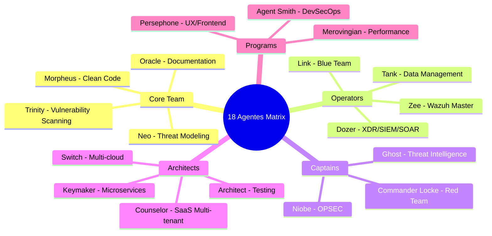

# 🎭 Guia Completo - 18 Agentes Matrix

## 🎯 **Visão Geral Completa**

O ecossistema Matrix agora conta com **18 agentes especializados**, organizados em 5 categorias estratégicas, oferecendo cobertura completa para desenvolvimento, segurança, arquitetura e operações.

<div align="center">



</div>

---

## 🌟 **Core Team - The Chosen Ones (4 Agentes)**

### 🎯 **Neo - Threat Modeling & Security Analysis**
- **Especialização:** Análise de ameaças, modelagem de segurança, OWASP Threat Dragon
- **Quando usar:** Threat modeling, security assessment, análise de riscos
- **Deliverables:** Modelos de ameaças, relatórios de segurança, análise OWASP

### ⚡ **Trinity - Vulnerability Scanning & Remediation**
- **Especialização:** Detecção e correção de vulnerabilidades, SAST/DAST, security fixes
- **Quando usar:** Análise de vulnerabilidades, security fixes, dependency updates
- **Deliverables:** Relatórios de vulnerabilidades, patches de segurança, análise CVE

### 🧙 **Morpheus - Clean Code & Refactoring**
- **Especialização:** Limpeza de código, eliminação de technical debt, aplicação de SOLID
- **Quando usar:** Refatoração, code smells, aplicação de design patterns
- **Deliverables:** Código refatorado, eliminação de duplicação, arquitetura limpa

### 🔮 **Oracle - Documentation & Knowledge**
- **Especialização:** Criação de documentação, README, guias técnicos, arquitetura de informação
- **Quando usar:** Documentação técnica, knowledge base, guias de arquitetura
- **Deliverables:** Documentação completa, diagramas, guias técnicos

---

## 🔗 **The Operators (4 Agentes)**

### 🔗 **Link - Defensive Security (Blue Team)**
- **Especialização:** Monitoramento, detecção de ameaças, resposta a incidentes, SIEM
- **Quando usar:** Blue team operations, incident response, threat hunting
- **Deliverables:** Playbooks de resposta, configurações SIEM, procedimentos de hunting

### 🛡️ **Tank - Data/Configuration Management**
- **Especialização:** Migração de dados, gestão de configurações, secrets management
- **Quando usar:** Data migration, configuration management, secrets rotation
- **Deliverables:** Scripts de migração, gestão de secrets, backup/recovery

### 🎖️ **Dozer - XDR/SIEM/SOAR Specialist**
- **Especialização:** Extended Detection & Response, SOAR playbooks, Yara/Suricata rules
- **Quando usar:** XDR deployment, SOAR automation, advanced detection rules
- **Deliverables:** Plataformas XDR, playbooks SOAR, regras de detecção

### 🏰 **Zee - Wazuh Master Specialist**
- **Especialização:** Wazuh deployment, GitHub repos, custom rules, enterprise integration
- **Quando usar:** Wazuh SIEM, custom rules, agent management, performance tuning
- **Deliverables:** Wazuh deployment, regras customizadas, configurações enterprise

---

## 👑 **The Captains (3 Agentes)**

### 👸 **Niobe - Operations Security (OPSEC)**
- **Especialização:** Segurança operacional, cultura de segurança, processos seguros
- **Quando usar:** OPSEC implementation, security culture, operational procedures
- **Deliverables:** Políticas OPSEC, treinamentos, procedimentos operacionais

### 🎖️ **Commander Locke - Offensive Security (Red Team)**
- **Especialização:** Testes de penetração éticos, validação de vulnerabilidades, POCs seguros
- **Quando usar:** Penetration testing, vulnerability validation, red team exercises
- **Deliverables:** Relatórios de pentest, POCs de vulnerabilidades, exercícios red team

### ⚡ **Ghost - Threat Intelligence & Attribution**
- **Especialização:** CTI analysis, IOCs, TTPs, MITRE ATT&CK, attribution
- **Quando usar:** Threat intelligence, IOC analysis, campaign attribution, CTI feeds
- **Deliverables:** Relatórios CTI, análise de IOCs, attribution reports

---

## 🏗️ **The Architects (4 Agentes)**

### 🏛️ **Architect - Testing & Quality Architecture**
- **Especialização:** Testes unitários, cobertura 95%+, integração com SonarCloud
- **Quando usar:** Test architecture, quality assurance, coverage analysis
- **Deliverables:** Test suites, quality reports, coverage dashboards

### 🏢 **Counselor - Multi-tenant SaaS Specialist**
- **Especialização:** Arquitetura SaaS, isolamento de tenants, escalabilidade multi-tenant
- **Quando usar:** SaaS architecture, tenant isolation, multi-tenancy scaling
- **Deliverables:** Arquitetura SaaS, tenant management, billing systems

### 🗝️ **Keymaker - Microservices Architect**
- **Especialização:** Quebra de monólitos, design de microserviços, APIs, service mesh
- **Quando usar:** Microservices design, API architecture, service decomposition
- **Deliverables:** Arquitetura de microserviços, APIs RESTful/GraphQL, service mesh

### ☁️ **Switch - Multi-cloud Specialist**
- **Especialização:** Arquitetura multi-cloud, migração entre clouds, otimização de custos
- **Quando usar:** Multi-cloud strategy, cloud migration, cost optimization
- **Deliverables:** Estratégias multi-cloud, planos de migração, otimização de custos

---

## 🎭 **The Programs (3 Agentes)**

### 🤖 **Agent Smith - DevSecOps & CI/CD**
- **Especialização:** Pipelines CI/CD, automação DevSecOps, compliance
- **Quando usar:** CI/CD pipelines, security automation, compliance frameworks
- **Deliverables:** Pipelines seguros, automação DevSecOps, relatórios compliance

### 🎭 **Merovingian - Performance & Observability**
- **Especialização:** Otimização de performance, monitoramento, métricas
- **Quando usar:** Performance optimization, observability, monitoring setup
- **Deliverables:** Dashboards de performance, métricas, sistemas de monitoramento

### 🌸 **Persephone - UX/Frontend Quality**
- **Especialização:** Interface do usuário, acessibilidade, experiência do usuário
- **Quando usar:** UX/UI optimization, accessibility compliance, frontend quality
- **Deliverables:** Interfaces otimizadas, compliance WCAG, testes de usabilidade

---

## 🔄 **Workflows Matrix Enterprise**

### **🛡️ Security-First Development Complete**
```bash
security_first_complete() {
    # Fase 1: Threat Analysis & Intelligence
    claude code --agent neo "Crie modelo completo de ameaças com OWASP Threat Dragon"
    claude code --agent ghost "Configure feeds de CTI e análise de IOCs"
    claude code --agent trinity "Execute análise completa de vulnerabilidades SAST/DAST"
    
    # Fase 2: Advanced Detection & Response
    claude code --agent dozer "Implemente plataforma XDR com playbooks SOAR"
    claude code --agent zee "Configure Wazuh SIEM enterprise completo"
    claude code --agent link "Configure monitoramento defensivo integrado"
    
    # Fase 3: Validation & Testing
    claude code --agent commander-locke "Execute red team testing controlado"
    claude code --agent architect "Crie testes de segurança com 95%+ cobertura"
    
    # Fase 4: Operations & Culture
    claude code --agent niobe "Estabeleça cultura de segurança operacional"
    claude code --agent agent-smith "Configure pipelines DevSecOps automatizados"
}
```

### **🏗️ Enterprise Architecture Excellence**
```bash
enterprise_architecture_excellence() {
    # Fase 1: SaaS Multi-tenant Foundation
    claude code --agent counselor "Projete arquitetura SaaS multi-tenant escalável"
    
    # Fase 2: Microservices Decomposition
    claude code --agent keymaker "Quebre monólito em microserviços bem definidos"
    
    # Fase 3: Multi-cloud Strategy
    claude code --agent switch "Configure estratégia multi-cloud otimizada"
    
    # Fase 4: Data & Performance
    claude code --agent tank "Projete gestão enterprise de dados e configurações"
    claude code --agent merovingian "Configure observabilidade completa"
    
    # Fase 5: Quality & Documentation
    claude code --agent architect "Implemente testing architecture abrangente"
    claude code --agent oracle "Gere documentação técnica completa"
}
```

### **🎯 Complete Development Lifecycle**
```bash
complete_development_lifecycle() {
    # Design & Planning Phase
    claude code --agent neo "Execute threat modeling inicial"
    claude code --agent oracle "Crie documentação de arquitetura"
    
    # Development Phase
    claude code --agent morpheus "Aplique Clean Code e princípios SOLID"
    claude code --agent architect "Implemente TDD com cobertura 95%+"
    
    # Security Phase
    claude code --agent trinity "Execute security scanning completo"
    claude code --agent ghost "Correlacione com threat intelligence"
    
    # Infrastructure Phase
    claude code --agent agent-smith "Configure pipelines DevSecOps"
    claude code --agent switch "Otimize infraestrutura multi-cloud"
    
    # Operations Phase
    claude code --agent merovingian "Configure monitoramento e métricas"
    claude code --agent link "Implemente operações blue team"
    
    # Quality & UX Phase
    claude code --agent persephone "Otimize experiência do usuário"
    claude code --agent oracle "Finalize documentação completa"
}
```

---

## 📊 **Matriz de Decisão Rápida - 18 Agentes**

| Necessidade | Agentes Recomendados | Workflow |
|-------------|---------------------|----------|
| **🔒 Security Assessment** | Neo → Trinity → Ghost → Commander Locke | Threat modeling → Vulnerability scanning → CTI analysis → Red team validation |
| **🏗️ Architecture Design** | Counselor → Keymaker → Switch → Tank | SaaS design → Microservices → Multi-cloud → Data management |
| **🛡️ Security Operations** | Dozer → Zee → Link → Niobe | XDR/SOAR → Wazuh → Blue team → OPSEC |
| **⚡ Performance & Quality** | Architect → Merovingian → Morpheus → Oracle | Testing → Performance → Clean code → Documentation |
| **🚀 Full Development** | Todos os 18 agentes | Complete development lifecycle workflow |

---

## 🎯 **Recomendações de Uso**

### **🟢 Projetos Pequenos/Médios (5-8 Agentes)**
```bash
essential_workflow() {
    claude code --agent morpheus "Refatoração e clean code"
    claude code --agent trinity "Security scanning"
    claude code --agent architect "Testing com 90%+ cobertura"
    claude code --agent agent-smith "CI/CD pipeline básico"
    claude code --agent oracle "Documentação essencial"
}
```

### **🟡 Projetos Empresariais (10-15 Agentes)**
```bash
enterprise_workflow() {
    # Use workflow security_first_complete() ou enterprise_architecture_excellence()
    # Adicione agentes específicos conforme necessidade do projeto
}
```

### **🔴 Projetos Críticos/Governamentais (Todos os 18 Agentes)**
```bash
critical_systems_workflow() {
    # Use complete_development_lifecycle() 
    # Inclui todos os 18 agentes para máxima segurança e qualidade
}
```

---

## ⚠️ **Considerações Importantes**

### **🎯 Seleção de Agentes**
- **Não use todos sempre** - Selecione agentes adequados ao contexto
- **Combine sinergicamente** - Ghost + Dozer para CTI-driven detection
- **Respeite dependências** - Neo antes de Trinity para security workflow

### **🔧 Performance**
- **Batch operations** quando possível
- **Use plan mode** para workflows complexos  
- **Monitor recursos** em operações intensivas

### **📈 Escalabilidade**
- **Customize agentes** para necessidades específicas
- **Crie workflows próprios** baseados nos templates
- **Documente decisões** usando Oracle

---

**🎭 O ecossistema completo de 18 Agentes Matrix oferece cobertura total para qualquer projeto, desde desenvolvimento ágil até sistemas críticos enterprise!**