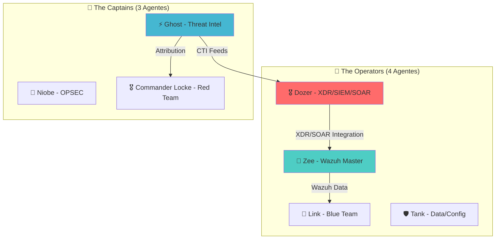

# 🎭 Novos Agentes Matrix - Security Operations

## 🎯 **Visão Geral**

Três novos agentes especializados foram adicionados ao ecossistema Matrix, expandindo nossas capacidades de **Advanced Security Operations** para um total de **18 agentes especializados**.

<div align="center">



</div>

---

## 🎖️ **Dozer - XDR/SIEM/SOAR Specialist**

### **🛡️ Especialização Principal**
Especialista em plataformas XDR enterprise, implementação de SOAR playbooks, desenvolvimento de regras Yara para detecção de malware, configuração de regras Suricata para monitoramento de rede.

### **🎯 Casos de Uso**
- **XDR Deployment:** Microsoft Sentinel, Splunk ES, CrowdStrike Falcon
- **SOAR Automation:** Phantom, Cortex XSOAR, custom playbooks
- **Detection Rules:** Yara malware detection, Suricata network monitoring
- **Threat Hunting:** Automated correlation e proactive hunting

### **⚡ Comandos Típicos**
```bash
# XDR Platform Configuration
claude code --agent dozer "Configure Microsoft Sentinel XDR com data connectors"
claude code --agent dozer "Implemente Splunk Enterprise Security com correlation searches"

# SOAR Playbook Development
claude code --agent dozer "Crie playbook SOAR para resposta a phishing"
claude code --agent dozer "Desenvolva automation para containment de malware"

# Detection Rules
claude code --agent dozer "Desenvolva regras Yara para família de malware APT"
claude code --agent dozer "Configure regras Suricata para detecção de C2"
```

### **🔗 Integrações Sinérgicas**
- **Com Zee:** XDR platforms + Wazuh integration
- **Com Link:** SOAR automation + Blue team response  
- **Com Ghost:** IOC automation + CTI feeds

---

## 🏰 **Zee - Wazuh Master Specialist**

### **🛡️ Especialização Principal**
Especialista master em Wazuh SIEM, com conhecimento profundo dos repositórios GitHub oficiais, documentação técnica, deployment enterprise, configuração de agents, customização de regras.

### **🎯 Casos de Uso**
- **Wazuh Deployment:** Single-node, cluster HA, enterprise setup
- **GitHub Integration:** Clone e análise de repositórios oficiais Wazuh
- **Custom Rules:** Desenvolvimento de regras de detecção personalizadas
- **Agent Management:** Windows, Linux, macOS agents
- **Performance Tuning:** Otimização para grandes volumes (1M+ EPS)

### **📚 Repositórios GitHub Monitored**
```bash
# Core repositories que o Zee conhece:
https://github.com/wazuh/wazuh
https://github.com/wazuh/wazuh-ruleset
https://github.com/wazuh/wazuh-kibana-app
https://github.com/wazuh/wazuh-documentation
https://github.com/wazuh/wazuh-docker
https://github.com/wazuh/wazuh-ansible
```

### **⚡ Comandos Típicos**
```bash
# Wazuh Deployment
claude code --agent zee "Configure Wazuh SIEM completo com cluster HA"
claude code --agent zee "Implemente Wazuh single-node para ambiente de teste"

# GitHub Repository Analysis
claude code --agent zee "Clone e analise repositório wazuh/wazuh-ruleset"
claude code --agent zee "Estude repositório wazuh/wazuh-docker para deployment"

# Custom Rules Development
claude code --agent zee "Desenvolva regras Wazuh para detecção de APT específico"
claude code --agent zee "Crie custom decoders para logs de aplicação"
```

### **🔗 Integrações Sinérgicas**
- **Com Dozer:** Unified SIEM + XDR correlation
- **Com Link:** Wazuh alerts + Blue team procedures
- **Com Ghost:** IOC integration + CTI feeds

---

## ⚡ **Ghost - Threat Intelligence & Attribution**

### **🛡️ Especialização Principal**
Especialista master em Cyber Threat Intelligence (CTI), análise de Indicadores de Comprometimento (IOCs), Táticas, Técnicas e Procedimentos (TTPs), atribuição de ataques a threat actors.

### **🎯 Casos de Uso**
- **IOC Analysis:** Correlação de indicadores de comprometimento
- **TTPs Mapping:** Mapeamento para MITRE ATT&CK framework
- **Threat Attribution:** Análise e atribuição de ataques a grupos específicos
- **CTI Integration:** Integração de feeds de threat intelligence
- **Campaign Analysis:** Análise de campanhas de ameaças avançadas

### **🔧 Plataformas CTI**
- **MISP** (Malware Information Sharing Platform)
- **OpenCTI** (Open Cyber Threat Intelligence)
- **ThreatConnect, Anomali ThreatStream**
- **IBM X-Force Exchange, VirusTotal Intelligence**
- **Recorded Future, AlienVault OTX**

### **⚡ Comandos Típicos**
```bash
# IOC Analysis & Correlation
claude code --agent ghost "Analise IOCs desta campanha de phishing"
claude code --agent ghost "Correlacione hashes MD5/SHA256 com threat actors conhecidos"

# TTPs Mapping & Attribution
claude code --agent ghost "Mapeie TTPs observados para MITRE ATT&CK framework"
claude code --agent ghost "Atribua este ataque a grupo de ameaças específico"

# Threat Intelligence Integration
claude code --agent ghost "Configure feeds CTI para SIEM/SOAR integration"
claude code --agent ghost "Desenvolva IOC enrichment pipeline"
```

### **🔗 Integrações Sinérgicas**
- **Com Neo:** Intelligence-driven modeling + Threat scenarios
- **Com Commander Locke:** Real TTPs + Red team scenarios
- **Com Dozer:** Intelligence feeds + SOAR playbooks

---

## 🚀 **Workflows Integrados - 18 Agentes Matrix**

### **🛡️ Advanced Security Operations Workflow**
```bash
advanced_security_operations() {
    echo "🔍 Fase 1: Threat Intelligence & Attribution"
    claude code --agent ghost "Configure feeds de CTI e análise de IOCs"
    claude code --agent ghost "Correlacione TTPs com grupos de ameaças conhecidos"
    
    echo "🎖️ Fase 2: XDR/SOAR Implementation"
    claude code --agent dozer "Implemente plataforma XDR com playbooks SOAR"
    claude code --agent dozer "Desenvolva regras Yara para detecção de malware"
    
    echo "🏰 Fase 3: Wazuh Enterprise Deployment"
    claude code --agent zee "Configure Wazuh SIEM completo com regras customizadas"
    claude code --agent zee "Integre Wazuh com outras ferramentas de segurança"
    
    echo "🔗 Fase 4: Integrated Detection & Response"
    claude code --agent link "Integre todas as ferramentas para resposta coordenada"
}
```

### **🔍 Threat Detection Excellence Workflow**
```bash
threat_detection_excellence() {
    echo "🎭 Fase 1: Malware Detection Rules"
    claude code --agent dozer "Desenvolva regras Yara para detecção de malware avançado"
    
    echo "🌐 Fase 2: Network Detection Rules"
    claude code --agent dozer "Configure regras Suricata para detecção de rede"
    
    echo "🏰 Fase 3: Wazuh Custom Rules"
    claude code --agent zee "Customize regras Wazuh para ambiente específico"
    
    echo "⚡ Fase 4: Threat Intelligence Integration"
    claude code --agent ghost "Integre CTI feeds com ferramentas de detecção"
}
```

---

## 📊 **Matriz de Especialização Atualizada**

| Categoria | Agentes | Especialização |
|-----------|---------|----------------|
| **🌟 Core Team** | Neo, Trinity, Morpheus, Oracle | Threat modeling, vulnerability scanning, clean code, documentation |
| **🔗 Operators** | Link, Tank, **Dozer**, **Zee** | Blue team, data management, **XDR/SOAR**, **Wazuh** |
| **👑 Captains** | Niobe, Commander Locke, **Ghost** | OPSEC, red team, **threat intelligence** |
| **🏗️ Architects** | Architect, Counselor, Keymaker, Switch | Testing, SaaS, microservices, multi-cloud |
| **🎭 Programs** | Agent Smith, Merovingian, Persephone | DevSecOps, performance, UX |

---

## ⚠️ **Considerações de Deployment**

### **🔧 Prerequisites**
- **Dozer:** Requer acesso a plataformas XDR (Sentinel, Splunk, etc.)
- **Zee:** Necessita conhecimento dos repositórios Wazuh GitHub
- **Ghost:** Precisa de feeds CTI e acesso a plataformas de threat intelligence

### **🎯 Melhores Práticas**
1. **Use os agentes em sinergia** - Combine Ghost + Dozer para CTI-driven detection
2. **Integre com ferramentas existentes** - Zee pode integrar com qualquer SIEM
3. **Monitore performance** - Dozer ajuda a otimizar detecção rules
4. **Mantenha feeds atualizados** - Ghost precisa de CTI feeds frescos

---

**🎭 Os novos agentes Matrix elevam suas capacidades de Security Operations para o nível enterprise!**